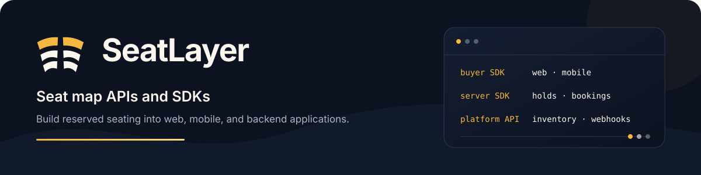

  

SeatLayer provides APIs and SDKs for interactive seating charts in web and
mobile apps. Start with a ready seat picker or compose the chart into your own
interface, with live seat availability, temporary holds, and server-side booking.

[Seat map SDK and API overview](https://seatlayer.io/developers/) ·
[Documentation](https://docs.seatlayer.io/) ·
[Seating chart demos](https://app.seatlayer.io/demo) ·
[Support](mailto:hello@seatlayer.io)

## Choose a seat map SDK

| Platform | Package | Guide and examples |
| --- | --- | --- |
| JavaScript / TypeScript | [`@seatlayer/js`](https://www.npmjs.com/package/@seatlayer/js) | [JavaScript seat map SDK](https://docs.seatlayer.io/buyer-sdk/install/) |
| React | [`@seatlayer/react`](https://www.npmjs.com/package/@seatlayer/react) | [React seating chart components](https://docs.seatlayer.io/buyer-sdk/react/) |
| Vue | [`@seatlayer/vue`](https://www.npmjs.com/package/@seatlayer/vue) | [Vue seating chart components](https://docs.seatlayer.io/buyer-sdk/vue/) |
| Angular | [`@seatlayer/angular`](https://www.npmjs.com/package/@seatlayer/angular) | [Angular seating chart components](https://docs.seatlayer.io/buyer-sdk/angular/) |
| Flutter | [`seatlayer`](https://pub.dev/packages/seatlayer) | [Flutter seat picker SDK](https://docs.seatlayer.io/buyer-sdk/flutter/) |
| React Native / Expo | [`@seatlayer/react-native`](https://www.npmjs.com/package/@seatlayer/react-native) | [React Native seat map SDK](https://docs.seatlayer.io/buyer-sdk/react-native/) |
| Swift / SwiftUI | [iOS Swift package](https://github.com/seatlayer/seatlayer-ios) | [iOS seating chart SDK](https://docs.seatlayer.io/buyer-sdk/ios/) |
| Kotlin / Jetpack Compose | [Android Maven package](https://central.sonatype.com/artifact/io.seatlayer/seatlayer-android) | [Android seating chart SDK](https://docs.seatlayer.io/buyer-sdk/android/) |

## Connect your backend

Use a server SDK to inspect holds, confirm bookings, manage events and inventory,
and verify webhooks. In a Platform/SDK integration, your backend owns payment,
orders, tickets, and refunds.

| Language | Package | Guide |
| --- | --- | --- |
| Node.js | [`@seatlayer/server`](https://www.npmjs.com/package/@seatlayer/server) | [Node.js server SDK](https://docs.seatlayer.io/server-sdk/node/) |
| Python | [`seatlayer`](https://pypi.org/project/seatlayer/) | [Python server SDK](https://docs.seatlayer.io/server-sdk/python/) |
| PHP | [`seatlayer/seatlayer-php`](https://packagist.org/packages/seatlayer/seatlayer-php) | [PHP server SDK](https://docs.seatlayer.io/server-sdk/php/) |
| Java | [`io.seatlayer:seatlayer-java`](https://central.sonatype.com/artifact/io.seatlayer/seatlayer-java) | [Java server SDK](https://docs.seatlayer.io/server-sdk/java/) |
| Go | [`github.com/seatlayer/seatlayer-go`](https://pkg.go.dev/github.com/seatlayer/seatlayer-go) | [Go server SDK](https://docs.seatlayer.io/server-sdk/go/) |
| Ruby | [`seatlayer`](https://rubygems.org/gems/seatlayer) | [Ruby server SDK](https://docs.seatlayer.io/server-sdk/ruby/) |
| .NET | [`SeatLayer`](https://www.nuget.org/packages/SeatLayer) | [.NET server SDK](https://docs.seatlayer.io/server-sdk/dotnet/) |

## Build the seating experience

- **Customize the buyer UI:** choose the complete picker or compose a chart with
  your own controls. Start with your platform guide above.
- **Add 3D seat views:** explore the [interactive 3D seating chart](https://seatlayer.io/3d-seat-map/)
  and the supported buyer-view controls.
- **Design venues inside your product:** use [embedded Designer sessions](https://docs.seatlayer.io/platform/embedded-designer/)
  for chart authoring in your organizer interface.
- **Work with agents:** use the [SeatLayer AI Toolkit](https://github.com/seatlayer/seatlayer-ai-toolkit)
  for integration help and the [buyer WebMCP tools](https://docs.seatlayer.io/buyer-sdk/webmcp-agent-tools/)
  for seat selection in compatible browser assistants.
- **Try a large chart:** open the [53,018-seat stadium demo](https://app.seatlayer.io/demo/play/large-stadium)
  and read the [renderer performance documentation](https://docs.seatlayer.io/platform/renderer-performance/).

## Hosted ticketing and WordPress

Managed Ticketing provides event pages and checkout using the organizer's
connected payment account. The [WordPress seating chart plugin](https://github.com/seatlayer/seatlayer-wordpress)
embeds that buyer experience in an existing site. See the
[WordPress integration guide](https://docs.seatlayer.io/integrations/wordpress/)
for the approved Managed account requirement and setup.

[Choose an integration](https://docs.seatlayer.io/start/choose-an-integration/) ·
[Service pricing](https://seatlayer.io/pricing/)
