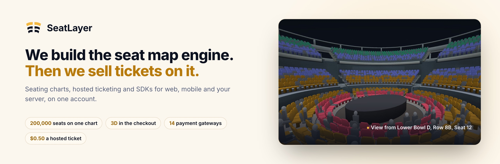
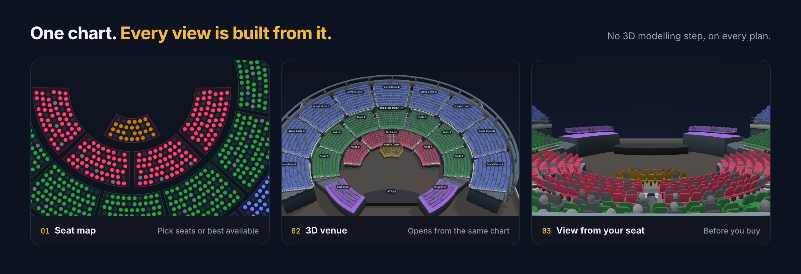
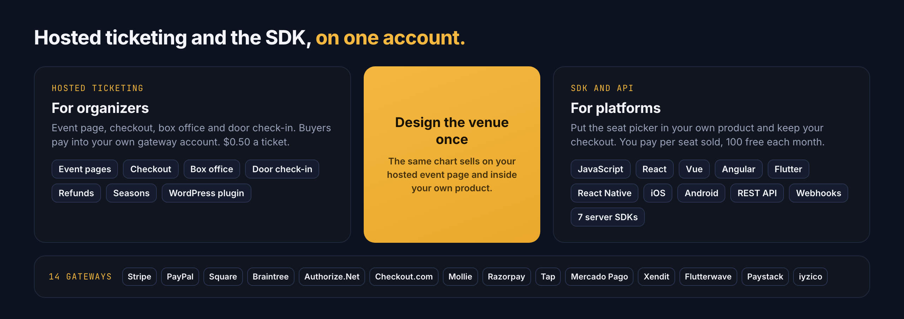

<picture>
  <source media="(prefers-color-scheme: dark)" srcset="./assets/seatlayer-hero-dark.jpg">
  
</picture>

SeatLayer builds its own seat map engine and sells reserved-seat tickets on it.
Organizers sell with Hosted Ticketing on their own payment gateway. Platforms put
the seat picker in their product with the SDK and API. Both run on one account
and the same charts.

[Website](https://seatlayer.io/) ·
[Documentation](https://docs.seatlayer.io/) ·
[Live demos](https://app.seatlayer.io/demo) ·
[Pricing](https://seatlayer.io/pricing/) ·
[hello@seatlayer.io](mailto:hello@seatlayer.io)

## What is different

- **Our own seat map engine.** The same renderer draws a 300-seat studio and a
  200,000-seat stadium. [Open the 200,000-seat demo](https://app.seatlayer.io/demo/play/century-stadium-200k).
- **3D in the checkout.** Every chart opens in 3D and shows the view from each
  seat, with no modelling step. A seat picked in 3D is the same seat in the cart,
  the hold and the booking. 3D covers venues up to 60,000 seats.
  [See the 3D seat map](https://seatlayer.io/3d-seat-map/).
- **Hosted Ticketing and the SDK on one account.** Design a venue once, then sell
  it on your hosted event page, inside your own product, or both.
- **14 payment gateways.** Buyers pay straight into the organizer's own account.
- **Bring any floor plan.** Upload an image or PDF and click one seat per block
  to add every printed seat. [How Click the plan works](https://docs.seatlayer.io/designer/reference-plan-import/).

## Pricing

- **Hosted Ticketing:** $0.50 per confirmed ticket, seated or not. Your first 25
  tickets are free.
- **SDK and API:** 100 free confirmed seats per organization each month, then
  $0.10 down to $0.05 a seat. Credits never expire.

## Seat map SDKs

| Platform | Package | Guide |
| --- | --- | --- |
| JavaScript / TypeScript | [`@seatlayer/js`](https://www.npmjs.com/package/@seatlayer/js) | [JavaScript seat map SDK](https://docs.seatlayer.io/buyer-sdk/install/) |
| React | [`@seatlayer/react`](https://www.npmjs.com/package/@seatlayer/react) | [React seating chart](https://docs.seatlayer.io/buyer-sdk/react/) |
| Vue | [`@seatlayer/vue`](https://www.npmjs.com/package/@seatlayer/vue) | [Vue seating chart](https://docs.seatlayer.io/buyer-sdk/vue/) |
| Angular | [`@seatlayer/angular`](https://www.npmjs.com/package/@seatlayer/angular) | [Angular seating chart](https://docs.seatlayer.io/buyer-sdk/angular/) |
| Flutter | [`seatlayer`](https://pub.dev/packages/seatlayer) | [Flutter seat picker](https://docs.seatlayer.io/buyer-sdk/flutter/) |
| React Native / Expo | [`@seatlayer/react-native`](https://www.npmjs.com/package/@seatlayer/react-native) | [React Native seat map](https://docs.seatlayer.io/buyer-sdk/react-native/) |
| Swift / SwiftUI | [seatlayer-ios](https://github.com/seatlayer/seatlayer-ios) | [iOS seating chart](https://docs.seatlayer.io/buyer-sdk/ios/) |
| Kotlin / Compose | [`io.seatlayer:seatlayer-android`](https://central.sonatype.com/artifact/io.seatlayer/seatlayer-android) | [Android seating chart](https://docs.seatlayer.io/buyer-sdk/android/) |
| WordPress | [seatlayer-wordpress](https://github.com/seatlayer/seatlayer-wordpress) | [WordPress seating chart plugin](https://docs.seatlayer.io/integrations/wordpress/) |

## Server SDKs

Confirm bookings, manage events and inventory, and verify webhooks from your backend.

| Language | Package | Guide |
| --- | --- | --- |
| Node.js | [`@seatlayer/server`](https://www.npmjs.com/package/@seatlayer/server) | [Node.js](https://docs.seatlayer.io/server-sdk/node/) |
| Python | [`seatlayer`](https://pypi.org/project/seatlayer/) | [Python](https://docs.seatlayer.io/server-sdk/python/) |
| PHP | [`seatlayer/seatlayer-php`](https://packagist.org/packages/seatlayer/seatlayer-php) | [PHP](https://docs.seatlayer.io/server-sdk/php/) |
| Java | [`io.seatlayer:seatlayer-java`](https://central.sonatype.com/artifact/io.seatlayer/seatlayer-java) | [Java](https://docs.seatlayer.io/server-sdk/java/) |
| Go | [`seatlayer-go`](https://pkg.go.dev/github.com/seatlayer/seatlayer-go) | [Go](https://docs.seatlayer.io/server-sdk/go/) |
| Ruby | [`seatlayer`](https://rubygems.org/gems/seatlayer) | [Ruby](https://docs.seatlayer.io/server-sdk/ruby/) |
| .NET | [`SeatLayer`](https://www.nuget.org/packages/SeatLayer) | [.NET](https://docs.seatlayer.io/server-sdk/dotnet/) |

## Start building

- [Quickstart](https://docs.seatlayer.io/start/quickstart/) and [holds and checkout](https://docs.seatlayer.io/buyer-sdk/holds-and-checkout/)
- Runnable examples: [React and Vite](https://github.com/seatlayer/seatlayer-react-example) · [Next.js](https://github.com/seatlayer/seatlayer-nextjs-example)
- Moving from seats.io: [migration guide](https://docs.seatlayer.io/integrations/migrate-from-seatsio/)
- AI agents: [SeatLayer AI Toolkit](https://github.com/seatlayer/seatlayer-ai-toolkit) and the [Designer MCP](https://docs.seatlayer.io/agents/designer-mcp/)
- Performance evidence: [seatlayer-performance](https://github.com/seatlayer/seatlayer-performance) has the fixtures, method and raw runs behind the 200,000-seat benchmark (chart-ready in 1.95 s on desktop, 15 September 2026)
